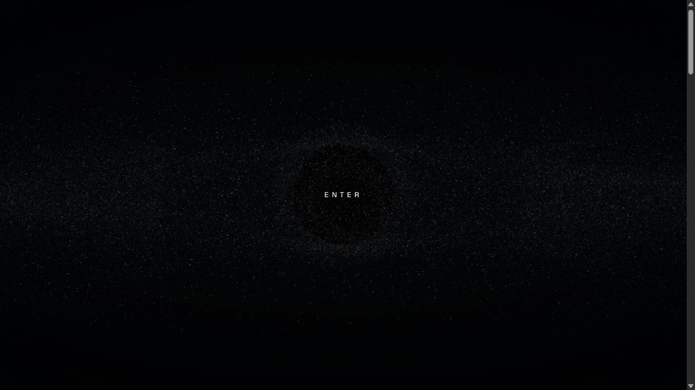

# Liangray Li — Portfolio

> An immersive creative-developer portfolio built around typography, motion, and a responsive particle identity.




## Overview

This portfolio explores the space between interaction design and creative development. Its opening identity is rendered as an animated Three.js particle field, followed by an editorial project index and restrained personal sections designed to keep the work at the center.

## Highlights

- GPU-rendered particle typography with a deliberate enter transition.
- Responsive editorial layout with oversized type and strong visual rhythm.
- Accessible landmarks, navigation labels, and interaction controls.
- Open Graph artwork and a custom favicon for polished sharing.
- React Server Components tooling through Vinext and Vite.
- Cloudflare Workers-compatible production output.

## Tech stack

React 19 · TypeScript · Three.js · Tailwind CSS · Vinext · Vite · Cloudflare Workers

## Run locally

Requires Node.js 22.13 or newer.

```bash
npm install
npm run dev
```

Quality checks:

```bash
npm run lint
npm run build
```

## Video walkthrough

> 🎬 **Coming soon** — reserved for a guided tour of the particle interaction and selected-work experience.
